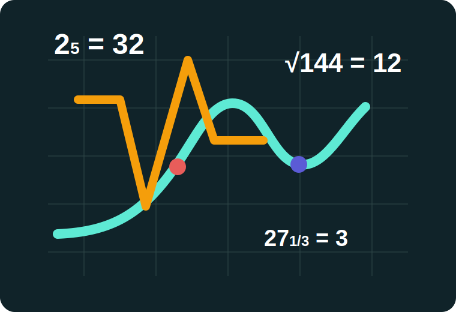
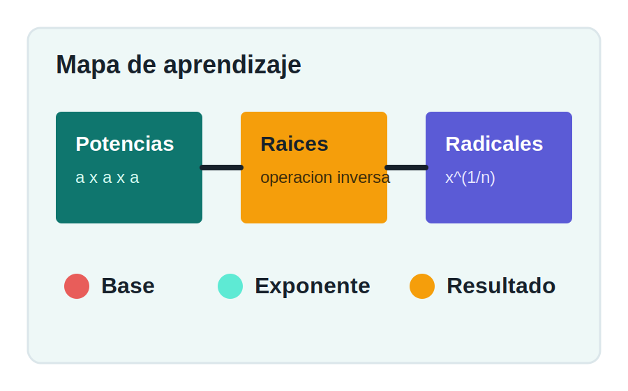

<p align="center">
  
</p>

<h1 align="center">EducaRadix</h1>

<p align="center">
  Aplicacion web educativa para practicar potencias, raices y exponentes fraccionarios.
</p>

<p align="center">
  
  
  
  
</p>

<p align="center">
  
</p>

EducaRadix es una aplicacion web educativa para aprender y practicar potencias, raices y exponentes fraccionarios mediante actividades interactivas, gestion de estudiantes y un panel administrativo.

El proyecto esta construido como una aplicacion Java Web tradicional y genera un archivo `.war` llamado `educaradix.war`, listo para desplegarse en Tomcat dentro de una red local.

## Caracteristicas Principales

- Inicio de sesion y registro de estudiantes.
- Roles de usuario: administrador y estudiante.
- Panel administrativo para gestionar usuarios, bloqueos, bitacora y progreso.
- Modulo de estudiante con categorias, juegos, perfil y actividades.
- Registro de eventos en bitacora.
- Conexion a PostgreSQL mediante JDBC.
- Empaquetado Maven como archivo WAR.
- Rutas declaradas explicitamente en `WEB-INF/web.xml` para despliegues estables en Tomcat.

## Vista Visual

<p align="center">
  
</p>

| Recurso | Ubicacion | Uso |
| --- | --- | --- |
| Logo principal | `src/main/webapp/assets/img/logo-radix.svg` | Identidad visual de EducaRadix |
| Hero educativo | `src/main/webapp/assets/img/power-root-hero.svg` | Imagen principal de la experiencia |
| Mapa conceptual | `src/main/webapp/assets/img/power-root-map.svg` | Apoyo visual para potencias y raices |
| Leccion visual | `src/main/webapp/assets/video/leccion-radix.svg` | Material grafico para lecciones |
| Audios de interaccion | `src/main/webapp/assets/audio/` | Sonidos de exito, error e interaccion |

## Tecnologias Utilizadas

<table>
  <tr>
    <td align="center" width="140">
      <br>
      <strong>Java 11</strong>
    </td>
    <td>Lenguaje principal del backend. Se usa para controladores, modelos, filtros y acceso a datos.</td>
  </tr>
  <tr>
    <td align="center">
      <br>
      <strong>Tomcat 9</strong>
    </td>
    <td>Servidor recomendado para desplegar el archivo <code>educaradix.war</code>. Compatible con <code>javax.servlet</code>.</td>
  </tr>
  <tr>
    <td align="center">
      <br>
      <strong>PostgreSQL</strong>
    </td>
    <td>Base de datos del sistema. Guarda usuarios, bitacora y actividades de estudiantes.</td>
  </tr>
  <tr>
    <td align="center">
      <br>
      <strong>Maven</strong>
    </td>
    <td>Gestiona dependencias, compilacion y empaquetado del proyecto como archivo WAR.</td>
  </tr>
  <tr>
    <td align="center">
      <br>
      <strong>Bootstrap</strong>
    </td>
    <td>Framework CSS usado para la interfaz, formularios, botones y organizacion visual.</td>
  </tr>
  <tr>
    <td align="center">
      
      
      <br>
      <strong>HTML, CSS y JS</strong>
    </td>
    <td>Construyen la experiencia visual del sitio, estilos personalizados, validaciones y juegos interactivos.</td>
  </tr>
  <tr>
    <td align="center">
      <br>
      <strong>JUnit 5</strong>
    </td>
    <td>Dependencia incluida para pruebas automatizadas del proyecto.</td>
  </tr>
</table>

### Resumen Tecnico

| Componente | Tecnologia |
| --- | --- |
| Backend Web | Servlets y JSP |
| API Web | Java EE Web API 8 |
| Driver BD | PostgreSQL JDBC 42.7.11 |
| Formato final | WAR |
| Archivo generado | `target/educaradix.war` |

## Requisitos

Para compilar y ejecutar el proyecto se necesita:

- JDK 11 o superior.
- Maven Wrapper incluido en el proyecto (`mvnw` y `mvnw.cmd`).
- PostgreSQL accesible desde la maquina donde se despliegue la aplicacion.
- Apache Tomcat 9.

> Importante: este proyecto usa `javax.servlet`, por eso se recomienda Tomcat 9. Tomcat 10 usa `jakarta.servlet` y no es compatible directamente con esta estructura.

## Base de Datos

La aplicacion se conecta por defecto a:

```text
URL: jdbc:postgresql://172.17.42.121:5432/DB_educa
Usuario: postgres
Clave: 1234
```

El script de base de datos se encuentra en:

```text
educaradix_db.sql
```

Tablas principales:

- `usuarios`
- `bitacora`
- `actividades_estudiante`

Usuarios iniciales incluidos en el script:

| Rol | Correo | Clave |
| --- | --- | --- |
| Administrador | `admin@educaradix.edu` | `Admin1234` |
| Estudiante | `estudiante@educaradix.edu` | `Estudiante123` |

## Configuracion de Conexion

La conexion se configura en:

```text
src/main/java/io/github/josuevele77/educaradix/config/DatabaseConnection.java
```

Tambien se puede cambiar sin recompilar usando variables de entorno antes de iniciar Tomcat:

```bash
export EDUCARADIX_DB_URL="jdbc:postgresql://172.17.42.121:5432/DB_educa"
export EDUCARADIX_DB_USER="postgres"
export EDUCARADIX_DB_PASSWORD="1234"
```

En Windows PowerShell:

```powershell
$env:EDUCARADIX_DB_URL="jdbc:postgresql://172.17.42.121:5432/DB_educa"
$env:EDUCARADIX_DB_USER="postgres"
$env:EDUCARADIX_DB_PASSWORD="1234"
```

## Estructura del Proyecto

```text
educaradix/
|-- src/
|   |-- main/
|   |   |-- java/
|   |   |   `-- io/github/josuevele77/educaradix/
|   |   |       |-- config/       Conexion a la base de datos
|   |   |       |-- controllers/  Servlets y filtro de autenticacion
|   |   |       |-- dao/          Acceso a datos
|   |   |       `-- models/       Modelos del sistema
|   |   |-- resources/
|   |   |   `-- META-INF/
|   |   `-- webapp/
|   |       |-- assets/          CSS, JS, imagenes, audio y video
|   |       |-- views/           Vistas JSP por rol
|   |       |-- WEB-INF/
|   |       |   `-- web.xml      Mapeo de rutas, servlets y filtros
|   |       |-- index.jsp
|   |       |-- login.jsp
|   |       `-- registro.jsp
|-- educaradix_db.sql
|-- DEPLOY_VM.md
|-- pom.xml
|-- mvnw
`-- mvnw.cmd
```

## Rutas Principales

| Ruta | Descripcion |
| --- | --- |
| `/educaradix/` | Entrada principal de la aplicacion |
| `/educaradix/invitado` | Pagina publica de bienvenida |
| `/educaradix/login` | Inicio de sesion |
| `/educaradix/registro` | Registro de estudiantes |
| `/educaradix/logout` | Cierre de sesion |
| `/educaradix/admin/dashboard` | Panel administrativo |
| `/educaradix/admin/usuarios` | Gestion de usuarios |
| `/educaradix/admin/bitacora` | Bitacora del sistema |
| `/educaradix/estudiante/categorias` | Categorias del estudiante |
| `/educaradix/estudiante/jugar` | Juegos y actividades |
| `/educaradix/estudiante/perfil` | Perfil del estudiante |

## Compilacion

Desde la raiz del proyecto:

```bash
./mvnw clean package
```

En Windows:

```bat
mvnw.cmd clean package
```

Al finalizar, Maven genera:

```text
target/educaradix.war
```

## Despliegue en Tomcat

Copiar el archivo generado a la carpeta `webapps` de Tomcat:

```bash
sudo cp target/educaradix.war /opt/tomcat/webapps/
```

Si ya existia una version anterior, limpiar el despliegue viejo:

```bash
sudo systemctl stop tomcat
sudo rm -rf /opt/tomcat/webapps/educaradix
sudo rm -f /opt/tomcat/webapps/educaradix.war
sudo cp target/educaradix.war /opt/tomcat/webapps/
sudo systemctl start tomcat
```

La aplicacion quedara disponible en:

```text
http://IP_DE_LA_VM:8080/educaradix/
```

Ejemplo en red local:

```text
http://172.17.42.234:8080/educaradix/
```

## Verificacion Rapida

Despues del despliegue, revisar estas rutas:

```text
http://IP_DE_LA_VM:8080/educaradix/login
http://IP_DE_LA_VM:8080/educaradix/registro
http://IP_DE_LA_VM:8080/educaradix/invitado
```

Tambien se puede verificar que Tomcat haya desplegado el WAR revisando que exista:

```text
/opt/tomcat/webapps/educaradix/
```

## Solucion de Problemas

### Error 404 en `/educaradix/registro` o `/educaradix/login`

Verificar que:

- El archivo copiado se llame `educaradix.war`.
- Se haya eliminado la carpeta vieja `/opt/tomcat/webapps/educaradix`.
- Tomcat haya desplegado de nuevo el WAR.
- El archivo `WEB-INF/web.xml` exista dentro del despliegue.

### Error 500 al iniciar sesion

Normalmente indica un problema con la conexion a PostgreSQL. Verificar:

- Que la VM pueda acceder a `172.17.42.121:5432`.
- Que la base `DB_educa` exista.
- Que las credenciales sean correctas.
- Que PostgreSQL acepte conexiones remotas en `postgresql.conf`.
- Que `pg_hba.conf` permita conexiones desde la IP de la VM.
- Que el firewall permita el puerto `5432`.

### Tomcat 10 no ejecuta la aplicacion

Este proyecto usa `javax.servlet`, por lo tanto debe ejecutarse en Tomcat 9 o en un servidor Java EE 8 compatible.

## Comandos Utiles

Compilar:

```bash
./mvnw clean package
```

Ver logs de Tomcat:

```bash
sudo tail -f /opt/tomcat/logs/catalina.out
```

Reiniciar Tomcat:

```bash
sudo systemctl restart tomcat
```

Probar conectividad con PostgreSQL desde la VM:

```bash
nc -vz 172.17.42.121 5432
```

## Estado del Artefacto

El proyecto esta configurado en Maven para generar siempre:

```text
target/educaradix.war
```

Ese es el archivo que se debe copiar a Tomcat para levantar la aplicacion en red local.
